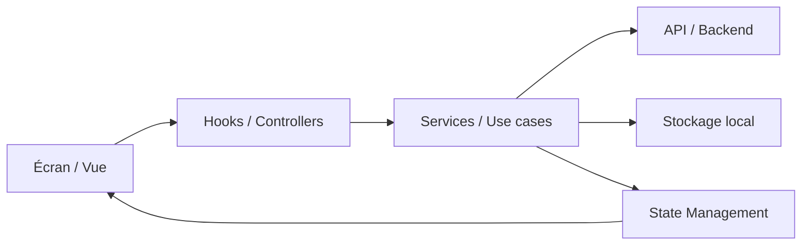

# Architecture de la solution

Ce document constitue une base de travail pour l’architecture de la solution, en cohérence avec un contexte orienté développement mobile moderne et évolutif.

## 1. Objectif

Proposer une architecture claire, maintenable et scalable pour une application basée sur un stack moderne, avec une séparation nette entre interfaces, logique métier, accès aux données et services externes.

## 2. Principes architecturaux

- Séparation des responsabilités : chaque couche a un rôle précis.
- Modularité : les fonctionnalités sont organisées par domaine métier.
- Testabilité : chaque partie peut être testée indépendamment.
- Maintenabilité : le code est lisible, typé et documenté.
- Évolutivité : la structure permet d’ajouter des fonctionnalités sans casser l’architecture existante.

## 3. Vue d’ensemble

La solution est organisée autour de 5 grands axes :

1. Interface utilisateur
2. Logique applicative
3. Accès aux données
4. Persistance et état
5. Observabilité et qualité

### Schéma simplifié



## 4. Structure recommandée

```text
src/
  app/                 # bootstrap de l’application
  navigation/          # configuration des routes et navigations
  features/            # modules métier indépendants
  components/          # composants réutilisables
  hooks/               # hooks personnalisés
  services/            # appels réseau, intégrations externes
  store/               # état global et gestion des données
  utils/               # helpers, formatters, constantes
  types/               # définitions TypeScript
  config/              # variables d’environnement et config
  assets/              # images, icônes, polices
  tests/               # tests unitaires / intégration
```

## 5. Composants principaux

### 5.1 Interface utilisateur

- Écrans et vues dédiés à chaque parcours utilisateur.
- Composants réutilisables pour garantir une UX cohérente.
- Design system centralisé pour éviter la duplication.

### 5.2 Logique métier

- Les cas d’usage sont isolés dans des modules métier.
- Les composants consomment des hooks ou des services plutôt que d’embarquer directement la logique.
- Les règles métier sont centralisées pour faciliter la maintenance.

### 5.3 Accès aux données

- Les appels réseau sont encapsulés dans des services dédiés.
- Les erreurs, retries et transformations de données sont gérées au niveau du service.
- Une couche d’abstraction permet de changer facilement de backend ou de protocole.

### 5.4 État et persistance

- L’état global est séparé de l’état local des écrans.
- Les données sensibles sont stockées de manière sécurisée.
- Les données de session, préférences ou cache local sont gérées de façon explicite.

## 6. Modèle de données et flux

Le flux général suit ce pattern :

1. L’utilisateur interagit avec un écran.
2. Le composant déclenche une action ou un hook.
3. Le service ou le use case exécute la logique métier.
4. Les données sont récupérées depuis l’API ou le stockage local.
5. L’état est mis à jour.
6. L’interface se rafraîchit automatiquement.

## 7. Bonnes pratiques de développement

- Utiliser TypeScript pour renforcer la sécurité des types.
- Préférer des composants petits, testables et réutilisables.
- Centraliser les constantes, configurations et erreurs.
- Utiliser des conventions de nommage homogènes.
- Mettre en place des tests unitaires et de bout en bout sur les parcours critiques.

## 8. Qualité, sécurité et opérations

### Qualité

- ESLint / Prettier pour la cohérence du code.
- Tests unitaires et tests d’intégration.
- Revues de code et standards de contribution.

### Sécurité

- Gestion sécurisée des tokens et secrets.
- Variables d’environnement centralisées.
- Validation des entrées et des réponses API.
- Permissions minimales pour l’accès aux ressources sensibles.

### Observabilité

- Logging structuré.
- Monitoring des erreurs et des performances.
- Traçabilité des événements critiques.

## 9. Déploiement et livraison

La solution peut être livrée via un pipeline CI/CD avec :

- vérification du linting et des tests,
- build de la version de test,
- publication de builds internes,
- déploiement automatisé vers les environnements cibles.

## 10. Références d’évolution

Cette architecture peut évoluer vers :

- une structure monorepo si plusieurs applications partagent des modules,
- une approche orientée microservices si la complexité métier augmente,
- une couche de synchronisation offline si l’expérience doit fonctionner sans réseau,
- une stratégie d’analytics et de monitoring plus avancée.

## 11. Visuel de site et ressemblence

Site d'annonce, listing. voici le lien de theme wordpress la quelle correspond plus le site que je voulais creer - https://wpdirectorykit.com/theme_preview/classified-ads-directory

## 12. Conclusion

Cette architecture offre une base solide pour une solution moderne, modulable et prête à évoluer. Elle peut être ajustée en fonction des contraintes techniques réelles du projet, des services backend et des besoins fonctionnels.
